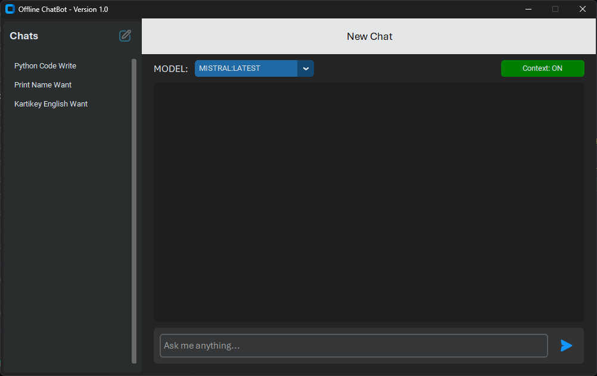
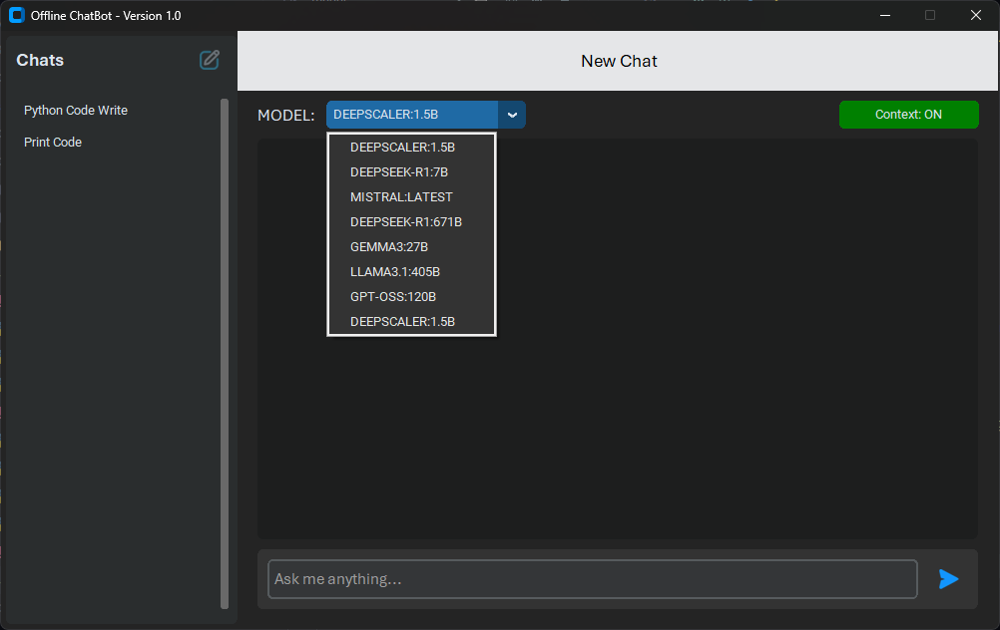

# 🤖 Offline Chatbot

An *AI-powered chatbot* that works *completely offline* using [Ollama](https://ollama.com).  
This project is built to provide a **fast, private, and internet-free AI assistant** for desktop users.

---

## ✨ Features
- 📴 *Works fully offline* (no internet required once models are installed)
- 🔄 Uses *Ollama* to run open-source LLMs (LLaMA, Mistral, Gemma, etc.)
- 🖥️ *User-friendly GUI* (built with `tkinter/customtkinter`)
- 💬 *Chat history* saving & reloading
- 🎨 Dark/Light themes
- 📂 Export conversations to `.txt` or `.json`
- 🎙️ (Future) Offline **voice input/output**

---

## 📸 Screenshots
| Chat Window | Settings |
|-------------|-----------|
|  |  |

---

## 🛠 Installation

1. ***Clone the Repository***
```bash
git clone https://github.com/piyushk789/OfflineChatbot.git
cd OfflineChatbot
```

2. ***Install Dependencies***
```bash
pip install -r requirements.txt
```

3. ***Install Ollama***

- Download from Ollama website
- Pull a model (example):
  ```ollama pull mistral```

4. ***Run the Chatbot***
```bash
python src/main.py
```

📦 **Prebuilt Application**

Download the latest Windows/Linux executable from the
👉 Releases Section: **COMING SOON**
